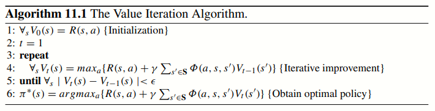

<h1>&#9968 Markov Decision Process' Value Iteration Algorithm;</h1>

The content of this repository served as an assignment project requested for the course Probabilistic Graphical Models at the <a href="https://www.inaoep.mx/">INAOE</a> as a student of the Master in Science in Computer Science. All the resources presented in the versions of this code were obtained from the class book that you can find in the references part. 

<strong>This application of the algorithm and information was for an only educational purpose</strong>

<h3>Description:</h3> Implement the the value iteration algorithm to solve a discrete MDP.

Professor:
- PhD <a href="https://ccc.inaoep.mx/~esucar/">Enrique Sucar</a>.

Student Involved:
- Mario De Los Santos. Github: <a href="https://github.com/MarSH-Up">MarSH-Up</a>. Email: madlsh3517@gmail.com

<em>Instructions</em>
1. Download the repository's file
2. Verify that the C++ version is at least C++ 14
3. Call the functions marked in the documentation

The following algorithm is based on the documentation provided by the professor but in the references. The value iteration algorithm consists in iteratively estimate the value for each state, s, based on Bellman's equation. The next image shows the pseudocode used to create this project.

<em>Example</em>
- 
- 

#References
-  Sucar, L. E. (2020). Probabilistic graphical models. Advances in Computer Vision and Pattern Recognition.London: Springer London. doi, 10(978), Chapter 11.
